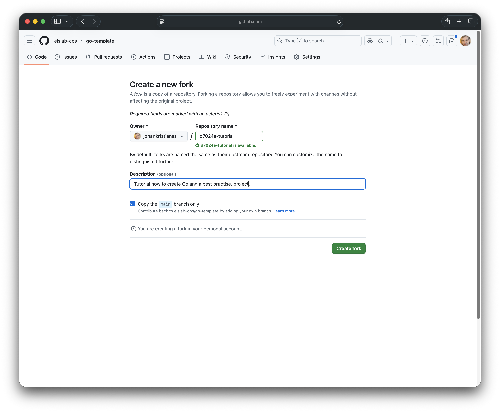

# Introduction 
This tutorial contains instructions how to create a Golang project according to best practice. We are going to use CPS [go-template](https://github.com/eislab-cps/go-template), which includes a working GitHub action and a simple CLI example.

## Create a fork of the `go-template` project.
1. Open browser and go to: [https://github.com/eislab-cps/go-template](https://github.com/eislab-cps/go-template)
2. Click on Fork (depicted inside the red circle)

And create a new fork on your Github user or organisation.


## Clone your new project
```bash
git clone git@github.com:johankristianss/d7024e-tutorial.git
cd d7024e-tutorial
```

## Rename project
Your project contains references originating from the original go-template project, e.g. Golang package names. Run the script below to rename the project to match the path to your Github project.

```bash
./rename-project.sh johankristianss/d7024e-tutorial
```

**Expected output:**
```console
=====================================
Renaming project from 'go-template' to 'johankristianss/d7024e-tutorial'
Updating module path from 'github.com/eislab-cps/go-template' to 'github.com/johankristianss/d7024e-tutorial'
Cleaning up old prefix 'github.com/eislab-cps/' → 'github.com/'
=====================================
Step 1: Updating file contents (project name)...
Updating ./internal/cli/version.go
Updating ./internal/cli/talk.go
Updating ./README.md
Updating ./rename-project.sh
Updating ./cmd/main.go
Updating ./go.mod
Step 2: Updating import paths...
Step 2b: Removing old prefix in import paths...
Fixing prefix in ./internal/cli/version.go
Fixing prefix in ./internal/cli/talk.go
Fixing prefix in ./README.md
Fixing prefix in ./rename-project.sh
Fixing prefix in ./cmd/main.go
Fixing prefix in ./go.mod
Step 3: Renaming files and directories...
Step 4: Updating 'module' line in go.mod...
=====================================
✅ Renaming completed!
✅ Project name: 'johankristianss/d7024e-tutorial'
✅ Module path: 'github.com/johankristianss/d7024e-tutorial'
=====================================
Next steps:
 1️⃣ Run: go mod tidy
 2️⃣ Test build: go build ./...
 3️⃣ Commit your changes!
```

## Step 4: Update Dependencies
Run the tidy command to update the go.mod files.

```bash
go mod tidy
```

## Use the Makefile
The project contains a `Makefile` that can be used to run tests or create a binary executable.
Note: The `make test` command will automatically be run by the Github action, making it impossible to merge code when some tests fail.

### Run the tests

```bash
make test
```

**Expected output:**
```console
=== RUN   TestNewHelloWorld
ERRO[0000] Error detected                                Error="This is an error"
--- PASS: TestNewHelloWorld (0.00s)
PASS
ok  	github.com/johankristianss/d7024e-tutorial/pkg/helloworld
```

## Compile CLI binary
```bash
make 
```

### Run the `helloworld` command.
```console
./bin/helloworld talk
```
```console
ERRO[0000] Error detected                                Error="This is an error"
INFO[0000] Talking...                                    Msg="Hello, World!" OtherMsg="Logging is cool!"
Hello, World!
```

The next [tutorial](https://github.com/eislab-cps/d7024e/XXXX) explains in details how the `helloworld` CLI works.
